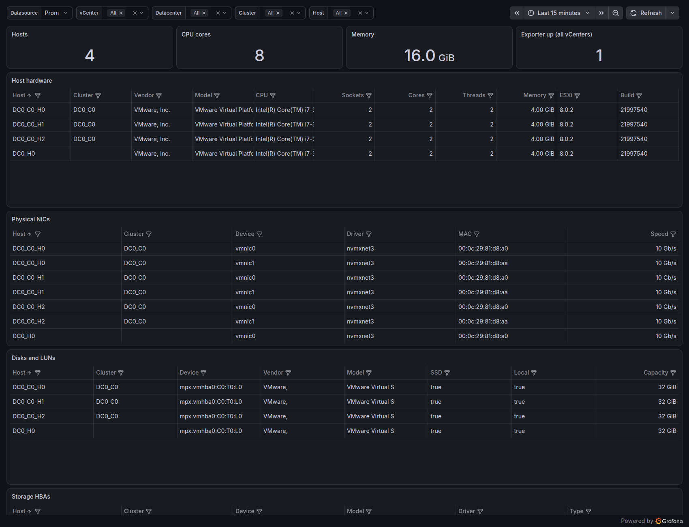

# vsphere-hardware-exporter

A small, read-only Prometheus exporter for the **static hardware inventory** of VMware ESXi hosts:
server vendor/model, BIOS, CPU, memory, physical NICs, disks/LUNs, HBAs and the ESXi build,
exposed as Prometheus *info* metrics so you can build inventory tables in Grafana.

Existing vSphere → Prometheus paths (Telegraf `inputs.vsphere`, `vmware_exporter`) focus on performance
counters and basic state. This exporter covers the part they leave out.

- Single static Go binary, distroless multi-arch image (`linux/amd64`, `linux/arm64`)
- Works with vCenter or a standalone ESXi host, with a **Read-only** account
- Hardware rarely changes, so data is refreshed in the background (default every hour) and served from cache:
  a slow or unreachable vCenter never blocks a scrape
- Serial numbers are **off by default**

## Quickstart

```bash
echo -n 'your-password' > vsphere_password.txt && chmod 600 vsphere_password.txt

# --user makes the container read the 0600 secret file as its owner (the image's default
# user is a non-root UID that could not read a file that only you can read).
docker run -d --name vsphere-hardware-exporter -p 9877:9877 \
  --user "$(id -u):$(id -g)" \
  -v "$PWD/vsphere_password.txt:/run/secrets/vsphere_password:ro" \
  -e VSPHERE_URL=https://vcenter.example.com \
  -e VSPHERE_USERNAME=readonly@vsphere.local \
  -e VSPHERE_PASSWORD_FILE=/run/secrets/vsphere_password \
  ghcr.io/redhatua/vsphere-hardware-exporter:latest

curl -s localhost:9877/metrics | grep ^vsphere_host_hw_info
```

Docker Compose: see [`examples/docker-compose.yml`](examples/docker-compose.yml).
Prometheus / vmagent scrape configs: [`examples/prometheus.yml`](examples/prometheus.yml), [`examples/vmagent.yml`](examples/vmagent.yml).
Grafana dashboard: [grafana.com/grafana/dashboards/25818](https://grafana.com/grafana/dashboards/25818) or [`dashboards/vsphere-hardware.json`](dashboards/vsphere-hardware.json), see [Grafana dashboard](#grafana-dashboard).

### Try it without a vCenter

```bash
make sim          # govmomi vCenter simulator on https://127.0.0.1:8989 (user/pass)
make run          # in another terminal
curl -s localhost:9877/metrics | grep ^vsphere_host
```

## Grafana dashboard



[`dashboards/vsphere-hardware.json`](dashboards/vsphere-hardware.json) shows a host hardware table, physical NICs,
disks/LUNs and HBAs, with `vCenter / Datacenter / Cluster / Host` filters. It has a **Datasource** selector at the top,
so it needs no editing and works both ways:

- **Import:** *Dashboards → New → Import*, enter the grafana.com ID `25818` (or upload the JSON file); select your Prometheus-compatible
  datasource (Prometheus, VictoriaMetrics, ...) in the dashboard's *Datasource* dropdown.
- **Provisioning** (Ansible, Helm, compose, ...): put the file in a folder and point a provider at it.

```yaml
# /etc/grafana/provisioning/dashboards/vsphere-hardware.yml
apiVersion: 1
providers:
  - name: vsphere-hardware
    type: file
    options:
      path: /var/lib/grafana/dashboards/vsphere-hardware
```

The dashboard is tested against Grafana 13.2 provisioned from a file. It relies on instant table queries and the
`merge` transformation, which are available in all current Grafana versions.

## Configuration

Every flag has an environment variable; flags win over the environment.

| Flag | Environment | Default | Description |
|---|---|---|---|
| `--vsphere.url` | `VSPHERE_URL` | – (required) | vCenter or ESXi URL. Must be `https`; `/sdk` is appended if no path is given. Must not contain credentials. |
| `--vsphere.username` | `VSPHERE_USERNAME` | – (required) | Account name. |
| – | `VSPHERE_PASSWORD` | – | Password. There is deliberately no password flag. |
| `--vsphere.password-file` | `VSPHERE_PASSWORD_FILE` | – | File containing the password (use instead of `VSPHERE_PASSWORD`). |
| `--vsphere.ca-file` | `VSPHERE_CA_FILE` | system roots | PEM CA bundle for verifying the server. |
| `--vsphere.insecure-skip-verify` | `VSPHERE_INSECURE_SKIP_VERIFY` | `false` | Skip TLS verification. Explicit opt-in, logs a warning. |
| `--web.listen-address` | `WEB_LISTEN_ADDRESS` | `:9877` | Listen address. |
| `--refresh-interval` | `REFRESH_INTERVAL` | `1h` | Inventory refresh interval (minimum `1m`). A failed refresh is retried after 1 minute. |
| `--refresh-timeout` | `REFRESH_TIMEOUT` | `2m` | Timeout of a single refresh. |
| `--host-include` | `HOST_INCLUDE` | all | Regexp; only matching host names are exported. |
| `--host-exclude` | `HOST_EXCLUDE` | none | Regexp; matching host names are skipped. |
| `--export-serial` | `EXPORT_SERIAL` | `false` | Export `vsphere_host_serial_info`. |
| `--log-level` | `LOG_LEVEL` | `info` | `debug`, `info`, `warn`, `error`. |
| `--version` | – | | Print version and exit. |

Endpoints: `/metrics`, `/healthz` (liveness), `/ready` (200 after the first successful refresh).

### vCenter permissions
Create a service account and assign the built-in **Read-only** role at the vCenter root with
*Propagate to children* enabled. That is enough for all hardware metrics. `vsphere_host_license_info`
additionally needs access to the license assignment API; if the account lacks it, that one metric is
silently omitted (a warning is logged) and everything else keeps working.

## Metrics

All `vsphere_host_*` metrics carry the labels `vcenter, datacenter, cluster, host`
(`cluster` is empty for hosts outside a cluster). *Info* metrics always have the value `1`.

| Metric | Extra labels | Description |
|---|---|---|
| `vsphere_host_hw_info` | `vendor, model, bios_version, bios_date, cpu_model, esxi_version, esxi_build` | Static hardware and ESXi product info |
| `vsphere_host_uuid_info` | `uuid` | Hardware UUID |
| `vsphere_host_serial_info` | `serial` | Serial / service tag. **Only with `--export-serial`** |
| `vsphere_host_license_info` | `license` | Assigned license name (vCenter only, best effort) |
| `vsphere_host_cpu_sockets` / `_cores` / `_threads` | | CPU topology |
| `vsphere_host_cpu_mhz` | | Frequency per core |
| `vsphere_host_memory_bytes` | | Installed memory |
| `vsphere_host_connected` | | 1 if connected to vCenter |
| `vsphere_host_powered_on` | | 1 if powered on |
| `vsphere_host_in_maintenance_mode` | | 1 if in maintenance mode |
| `vsphere_host_nic_info` | `device, driver, mac` | Physical NIC |
| `vsphere_host_nic_speed_mbps` | `device` | Link speed, `0` if the link is down |
| `vsphere_host_disk_info` | `canonical_name, vendor, model, ssd, local` | SCSI disk / LUN (`ssd`, `local` are `true`/`false`) |
| `vsphere_host_disk_capacity_bytes` | `canonical_name` | Disk capacity |
| `vsphere_host_hba_info` | `device, model, driver, type` | Storage HBA |
| `vsphere_hw_exporter_up` | | 1 if the last refresh succeeded |
| `vsphere_hw_exporter_last_success_timestamp_seconds` | | Time of the last successful refresh |
| `vsphere_hw_exporter_scrape_duration_seconds` | | Duration of the last refresh |

State (connected / powered on / maintenance) is a separate 0/1 gauge rather than a label on
`vsphere_host_hw_info`, so a vMotion evacuation or maintenance window does not create new series for the
inventory table. The serial number is its own metric for the same reason and so that it can be joined only where wanted.

Cardinality is bounded by *hosts × (disks + NICs + HBAs)*; there is no per-VM data.

Useful queries:

```promql
# hosts still on an old ESXi build
count by (esxi_version, esxi_build) (vsphere_host_hw_info)

# 1 GbE links in a 10 GbE estate, or links that are down
vsphere_host_nic_speed_mbps < 10000

# raw local SSD capacity per cluster
sum by (cluster) (vsphere_host_disk_capacity_bytes * on(vcenter, host, canonical_name) group_left vsphere_host_disk_info{ssd="true",local="true"})
```

## vSphere versions
The exporter uses only long-stable `HostSystem` properties (`summary.hardware`, `summary.config.product`,
`hardware.biosInfo`, `config.network.pnic`, `config.storageDevice`, `runtime`), available since vSphere 5.x,
and the client negotiates the API version, so 6.5 through 8.x are supported by design.
Notes:
- `ScsiDisk.ssd` / `localDisk` exist since vSphere 5.5; when a host does not report them they are exported as `false`.
- A host that is disconnected from vCenter reports no hardware details; only its state metrics are exported.
- License information is only available through vCenter, not from a standalone ESXi host.
- Automated tests run against govmomi's simulator (`vcsim`, which simulates vSphere 8.0), not against real 6.5/7.x
  systems. Reports from real environments are welcome.

## Development

```bash
make test    # go test -race ./...  (uses vcsim, no vCenter needed)
make lint    # golangci-lint
make sim     # run the simulator
```

Commits follow [Conventional Commits](https://www.conventionalcommits.org/); releases are semver tags (`vX.Y.Z`).

## License
Apache-2.0, see [LICENSE](LICENSE).
